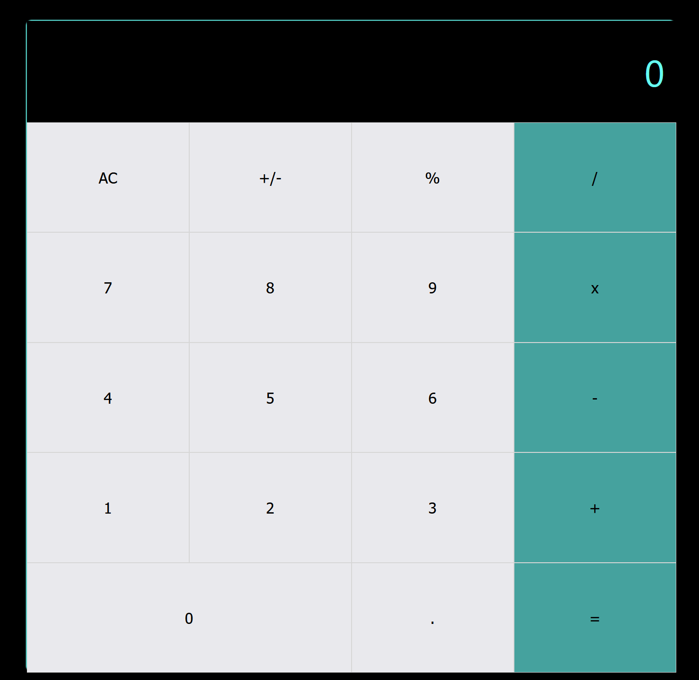

# Math Magicians

This is the first week;y project in the react Module. The project involves a simple yet powerful calculator that can do the basic math logic

## Built With

- HTML5
- CSS
- Javascript
- React

## Live Demo

[Live Demo Link](https://gallant-babbage-8243b5.netlify.app/)
[Live Demo Link](https://math-magician-affaxed.herokuapp.com/)

## Getting Started

To get a local copy up and running follow these simple example steps.

## Install

In your terminal, navigate to your current directory and run this code

`git clone https://github.com/DelhinRharl/math-magician.git`

Locate the directory in your file explorer

`cd math-magician`

Install npm or if installed already using this link

`npm install`

Start the web dev server depending on your configuration

`npm start`

The Project should now be live on your browser

## Authors

👤 **Author1**

- GitHub: [@DelhinRharl](https://github.com/DelhinRharl)
- Twitter: [@tdelhinrharl](https://twitter.com/delhinrharl)
- LinkedIn: [LinkedIn](https://linkedin.com/in/AffaxedKiprotich)

Contributions, issues, and feature requests are welcome!

Feel free to check the [issues page](https://github.com/DelhinRharl/math-magicians/issues).

## Show your support

Give a ⭐️ if you like this project!
## 📝 License

This project is [MIT](./MIT.md) licensed.